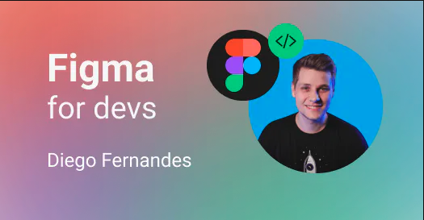

# Figma For Devs

#

👩🏻‍🎓 PDF: https://app.rocketseat.com.br/api/certificates/pdf/1cdc7c4f-7508-4924-85c6-d6ce2b90c1e9

🎓 Validar Certificado: https://app.rocketseat.com.br/certificates/1cdc7c4f-7508-4924-85c6-d6ce2b90c1e9

#

🎨 Figma: https://www.figma.com/file/1TImpFEJqtr6JMU8PuiXFm/Figma4devs-2?node-id=3%3A340&t=NDDNoT4ggsbKrW6U-1

## Aulas:

### Fundamentos

    - Introdução
    - Páginas, artboards e layers
    - Propriedades de estilo
    - Grupos & alinhamento
    - Linhas guia

### Criando interfaces

    -Criando formulário
    -Auto layout
    -Utilizando ícones
    -Constraints
    -Publicando styles
    -Componentes
    -Exportando SVGs

### Plugins

    - Tailwind
    - ColorsUI
    - FacesFaker

### Figma no código

    - Exportando Design Tokens
    - Automatizando design tokens
    - Tokens não-nativos do Figma

#

Atalhos usados durante o curso:

-   A: criar frame
-   Cmd + D: duplicar frames
-   Shift + R: rules
-   R: retangulo
-   R: texto
-   Cmd + G: grupo
